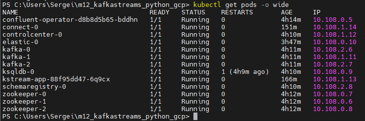

## Kafka connect in Kubernetes

### Create a custom docker image

For running the GCS connector, the Docker image was created and builded. Reference was included into CP config yaml file.


### Data was uploaded to GCP Cloud Storage into the bucket created in prior via Terraform


### GCP Kuberentes engine cluster was created via Terraform and connected to kubectl service


## Launch Confluent for Kubernetes

### Create a namespace

- Create the namespace to use:

  ```bash
  kubectl create namespace confluent
  ```

- Set this namespace to default for your Kubernetes context:

  ```bash
  kubectl config set-context --current --namespace confluent
  ```

### Install Confluent for Kubernetes

- Add the Confluent for Kubernetes Helm repository:

  ```bash
  helm repo add confluentinc https://packages.confluent.io/helm
  helm repo update
  ```

- Install Confluent for Kubernetes:

  ```bash
  helm upgrade --install confluent-operator confluentinc/confluent-for-kubernetes
  ```

### Install Confluent Platform

- Install all Confluent Platform components:

  ```bash
  kubectl apply -f ./confluent-platform.yaml
  ```

- Install a sample producer app and topic:

  ```bash
  kubectl apply -f ./producer-app-data.yaml
  ```

### View Control Center

- Set up port forwarding to Control Center web UI from local machine:

  ```bash
  kubectl port-forward controlcenter-0 9021:9021
  ```

- Browse to Control Center: [http://localhost:9021](http://localhost:9021)


## Create a kafka topics

- Name the new topics: "expedia" and "expedia_ext"


## Preparing and uploading the GCS connector configuration file through the API

- Config file was uploaded and connector was estableshed:


- As a result the data from GCP Cloud Storage was uploaded through "expedia" topic and proceeded:


## Creating and deploying image with Kafka Streams job

### Creating of app docker image

- To execute Python app, the Docker image was created and builded:


### Deploing of app docker image

```bash
kubectl create -f kstream-app.yaml 
```

 - Check that everything is deployed:

  ```bash
  kubectl get pods -o wide 
  ```




## Executing the Kafka stream job, procceding and enriching the data

After deploing the app starts to consume data from "expedia" topic, proceede it and write into "expedia_ext" topic:


### Creating Kafka stream, table and visualization the enriched data

Creating a stream:


Creating a table:


Data visualization was created from ksql cli:

```bash
kubectl exec -it ksqldb-0  -- ksql 
```


